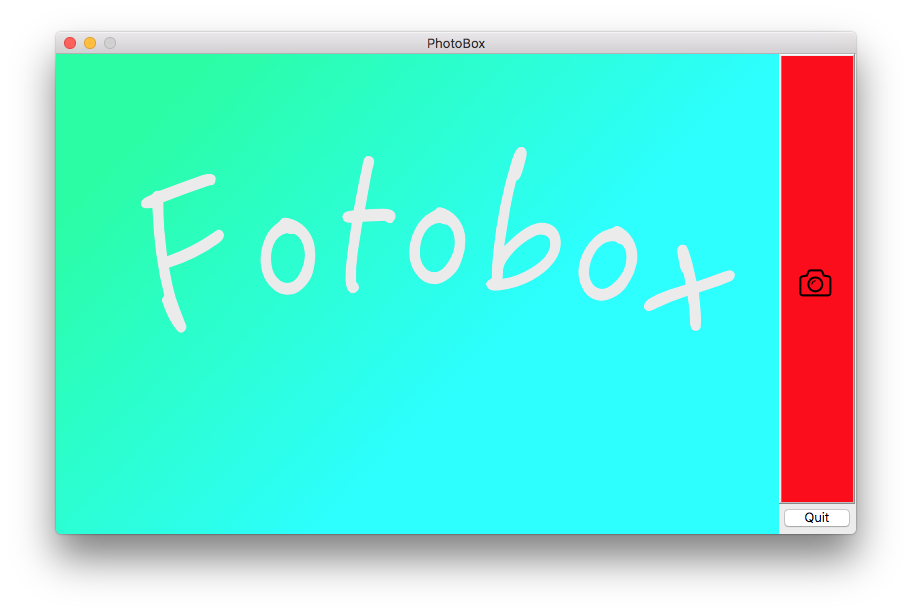
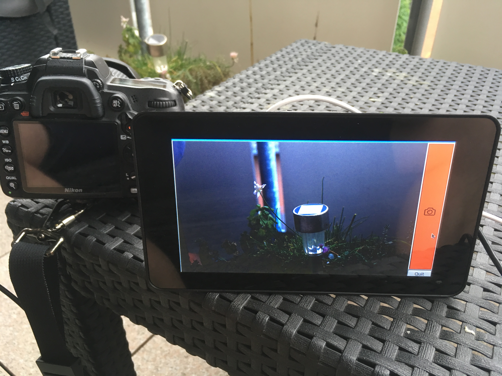

# Photobox

Photobox is a QT Application written in Python 3 that can be used to run on Weddings e.g. on a Raspberry PI with a Touch display.

It uses `gphoto2` to take pictures from a connected DSLR and shows them directly.

## Usage
```
python3 photobox.py
```

## Features

* can be used with all `gphoto2` compatible cameras
* comes with a 5 seconds timer
* the last taken images will be displayed after the shoot

## Screenshots


